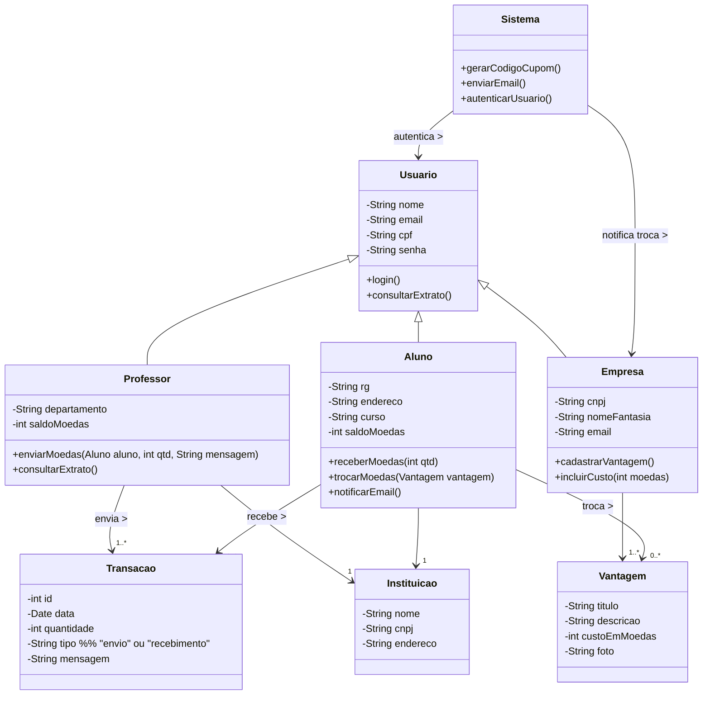

# 💰 Sistema de Moeda Estudantil – Release 1  
**Laboratório de Desenvolvimento de Software**
---

## 🧩 Descrição do Sistema  

O **Sistema de Moeda Estudantil** tem como objetivo reconhecer o mérito dos alunos por meio de uma **moeda virtual**.  
Professores podem distribuir moedas como forma de incentivo ao bom desempenho, e os alunos podem trocá-las por **produtos e descontos** em **empresas parceiras**.  

O sistema envolve três principais perfis de usuários: **aluno**, **professor** e **empresa parceira**.  

---

## 📖 Histórias de Usuário  

### 🧍‍♂️ HS01 – Cadastro de Aluno  

**Como** aluno,  
**Eu quero** realizar meu cadastro no sistema,  
**Para que** eu possa participar do programa de mérito e receber moedas dos professores.  

#### 🎯 Critérios de Aceitação  
- ✔ O sistema deve permitir o cadastro de novos alunos.  
- ✔ O cadastro deve incluir: nome, email, CPF, RG, endereço, instituição e curso.  
- ✔ O sistema deve listar as instituições previamente cadastradas.  
- ✔ Um email de confirmação deve ser enviado após o cadastro.  
- ✔ O aluno deve poder autenticar-se após o cadastro.  

#### 🔍 Detalhamento Técnico  
- **Pré-condição:** Instituição já cadastrada no sistema.  
- **Fonte de dados:** Base de alunos e instituições.  
- **Pós-condição:** Aluno cadastrado e habilitado para login.  
- **Regra de negócio:** Cada CPF deve ser único no sistema.  

---

### 👨‍🏫 HS02 – Distribuir Moedas  

**Como** professor,  
**Eu quero** enviar moedas para meus alunos,  
**Para que** eu possa reconhecer o bom desempenho e comportamento deles.  

#### 🎯 Critérios de Aceitação  
- ✔ O professor deve possuir saldo suficiente.  
- ✔ O sistema deve registrar aluno destinatário, valor e motivo (campo obrigatório).  
- ✔ O aluno deve receber um email de notificação.  
- ✔ O saldo do professor deve ser atualizado após a transação.  
- ✔ As moedas não utilizadas em um semestre devem acumular para o próximo.  

#### 🔍 Detalhamento Técnico  
- **Pré-condição:** Professor autenticado e com saldo positivo.  
- **Fonte de dados:** Base de professores, alunos e transações.  
- **Pós-condição:** Transação registrada e saldo atualizado.  
- **Regra de negócio:** Cada professor recebe 1.000 moedas a cada semestre (acumuláveis).  

---

### 🎓 HS03 – Trocar Moedas por Vantagem  

**Como** aluno,  
**Eu quero** trocar minhas moedas por produtos ou descontos,  
**Para que** eu possa aproveitar as vantagens oferecidas pelas empresas parceiras.  

#### 🎯 Critérios de Aceitação  
- ✔ O aluno deve visualizar uma lista de vantagens disponíveis (descrição, custo e imagem).  
- ✔ O sistema deve verificar se o aluno possui saldo suficiente.  
- ✔ O valor da troca deve ser descontado do saldo do aluno.  
- ✔ O sistema deve enviar um email com **cupom e código de validação** ao aluno.  
- ✔ O parceiro deve receber um email com o mesmo código para conferência.  

#### 🔍 Detalhamento Técnico  
- **Pré-condição:** Aluno autenticado e com saldo suficiente.  
- **Fonte de dados:** Base de vantagens e empresas parceiras.  
- **Pós-condição:** Transação de troca registrada e saldo atualizado.  
- **Regra de negócio:** Cada vantagem possui custo fixo definido pela empresa.  

---

### 🏢 HS04 – Cadastro de Empresa Parceira  

**Como** empresa parceira,  
**Eu quero** cadastrar minhas vantagens no sistema,  
**Para que** os alunos possam trocá-las por produtos ou descontos.  

#### 🎯 Critérios de Aceitação  
- ✔ O sistema deve permitir o cadastro de empresas parceiras.  
- ✔ A empresa deve poder cadastrar vantagens com descrição, custo e imagem.  
- ✔ Cada vantagem deve estar associada à empresa cadastrada.  
- ✔ A empresa deve receber um email sempre que uma troca for realizada.  
- ✔ O sistema deve autenticar a empresa para acesso ao painel.  

#### 🔍 Detalhamento Técnico  
- **Pré-condição:** Empresa cadastrada e autenticada.  
- **Fonte de dados:** Base de empresas e vantagens.  
- **Pós-condição:** Vantagem registrada e disponível aos alunos.  
- **Regra de negócio:** Cada vantagem deve conter descrição e imagem obrigatórias.  

---

### 💳 HS05 – Consultar Extrato  

**Como** usuário (professor ou aluno),  
**Eu quero** consultar meu extrato de transações,  
**Para que** eu possa acompanhar o histórico de envios, recebimentos e trocas.  

#### 🎯 Critérios de Aceitação  
- ✔ O sistema deve listar todas as transações do usuário autenticado.  
- ✔ Cada transação deve conter data, tipo (envio, recebimento ou troca) e valor.  
- ✔ Professores veem apenas os envios; alunos veem recebimentos e trocas.  
- ✔ O extrato deve exibir o saldo atual.  
- ✔ Deve ser possível filtrar o extrato por período.  

#### 🔍 Detalhamento Técnico  
- **Pré-condição:** Usuário autenticado.  
- **Fonte de dados:** Base de transações.  
- **Pós-condição:** Extrato exibido com informações atualizadas.  
- **Regra de negócio:** Apenas o dono da conta pode visualizar seu próprio extrato.  

---

## 📦 Diagrama de Casos de Uso do Sistema  

## Diagrama de Componentes

## Diagrama de Classe

---

### Diagrama de Entidade-Relacionamento

---

### Diagrama de Pacotes

---

### 🧩 Explicação do modelo:
- **Usuário** é uma classe abstrata, base para **Aluno**, **Professor** e **Empresa** (todos precisam de login e senha).  
- **Professor** e **Aluno** têm relação com **Instituição**, pois pertencem a ela.  
- **Transação** registra as operações de envio e recebimento de moedas.  
- **Vantagem** representa os benefícios oferecidos pelas empresas.  
- **Sistema** é uma classe de controle, responsável por autenticação e envio de notificações.  

---
