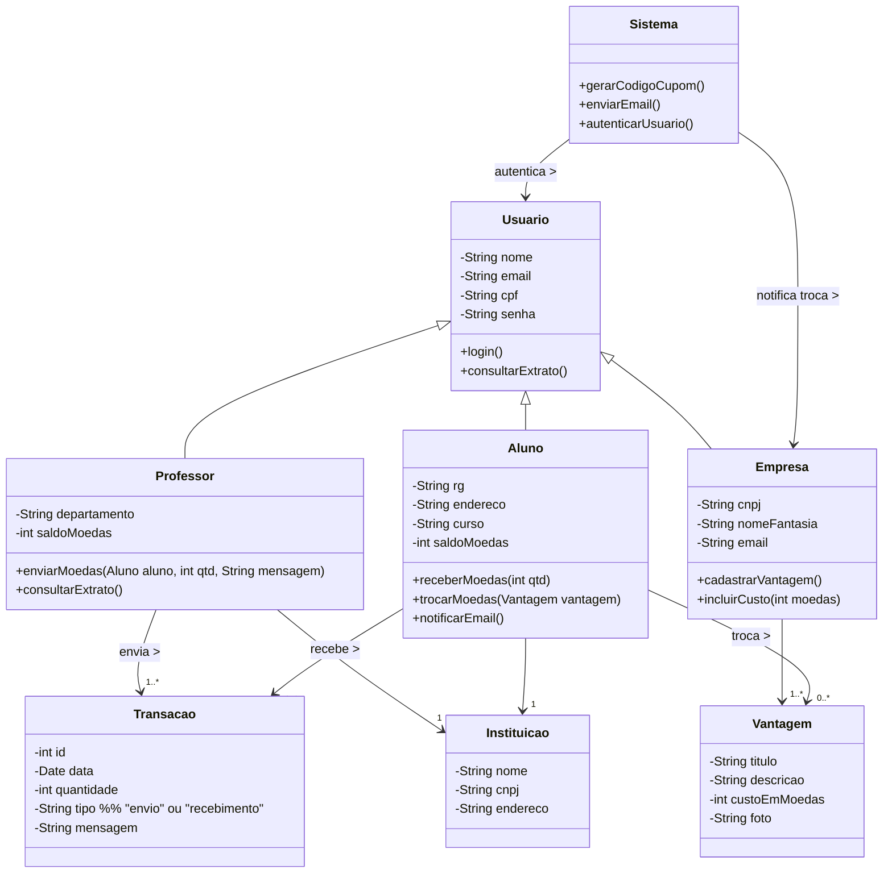
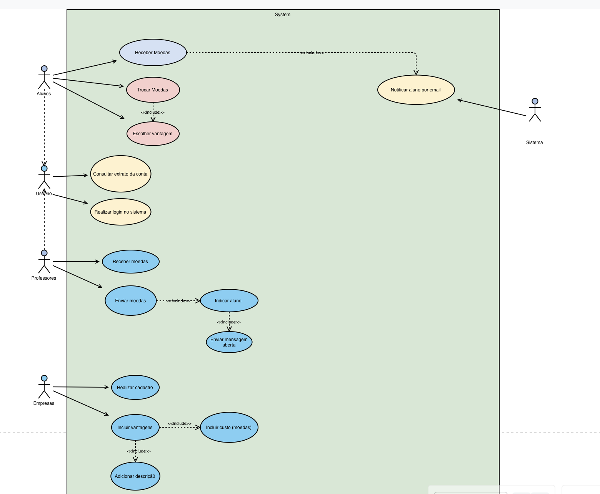

[](https://classroom.github.com/online_ide?assignment_repo_id=99999999&assignment_repo_type=AssignmentRepo) [](https://classroom.github.com/open-in-codespaces?assignment_repo_id=99999999)

# 💰 Sistema de Moeda Estudantil ✨

- Sistema de reconhecimento de mérito estudantil através de moeda virtual. **Incentiva o bom desempenho acadêmico através de recompensas.**  
- Logo do projeto: uma moeda virtual que conecta professores, alunos e empresas parceiras.


<table>
  <tr>
    <td width="800px">
      <div align="justify">
        O <b>Sistema de Moeda Estudantil</b> é uma aplicação desenvolvida para <b>reconhecer e incentivar o mérito acadêmico</b> através de uma moeda virtual inovadora. O sistema permite que <i>professores distribuam moedas</i> como forma de reconhecimento pelo bom desempenho, comportamento exemplar e participação ativa dos alunos. Os estudantes podem <i>trocar essas moedas</i> por produtos e descontos oferecidos por <b>empresas parceiras</b>, criando um ciclo virtuoso de <i>motivação e recompensa</i>. Desenvolvido com <b>arquitetura moderna</b> usando Spring Boot no back-end e tecnologias web no front-end, o sistema oferece <i>autenticação segura</i>, <i>gestão de transações</i> e <i>notificações por email</i>. Este projeto representa uma <b>solução completa de gamificação educacional</b> que promove o engajamento estudantil e estabelece parcerias estratégicas com o setor empresarial.
      </div>
    </td>
    <td>
      <div>
        
      </div>
    </td>
  </tr> 
</table>

## 🚧 Status do Projeto

### Badges básicos do projeto:

[](https://github.com/VianaLeo13/Laboratorio-Desenvolvimento-Software/releases)
[](#licença)


### Tecnologias utilizadas:

 
 

 
 


---

## 📚 Índice
- [Links Úteis](#-links-úteis)
- [Sobre o Projeto](#-sobre-o-projeto)
- [Funcionalidades Principais](#-funcionalidades-principais)
- [Tecnologias Utilizadas](#-tecnologias-utilizadas)
- [Arquitetura](#-arquitetura)
- [Histórias de Usuário](#-histórias-de-usuário)
- [Instalação e Execução](#-instalação-e-execução)
- [Estrutura de Pastas](#-estrutura-de-pastas)
- [Demonstração](#-demonstração)
- [Diagramas do Sistema](#-diagramas-do-sistema)
- [Autores](#-autores)
- [Contribuição](#-contribuição)
- [Agradecimentos](#-agradecimentos)
- [Licença](#-licença)

---

## 🔗 Links Úteis
* 🌐 **Demo Online:** [Acesse a Aplicação Web](http://localhost:5173)
  > 💻 **Descrição:** Aplicação frontend em desenvolvimento local.
* 🚀 **API Backend:** [Documentação da API](http://localhost:8080)
  > 📚 **Descrição:** API REST desenvolvida com Micronaut Framework.
* 📖 **Repositório:** [GitHub do Projeto](https://github.com/VianaLeo13/Laboratorio-Desenvolvimento-Software)
  > 🔗 **Descrição:** Código fonte completo e documentação técnica.

---

## 📝 Sobre o Projeto

O **Sistema de Moeda Estudantil** foi desenvolvido como parte do **Laboratório de Desenvolvimento de Software** com o objetivo de criar uma plataforma inovadora de **gamificação educacional**.

**Por que ele existe:** 
- Reconhecer e incentivar o mérito acadêmico de forma tangível e motivadora
- Criar um ecossistema de recompensas que conecte educação e mercado
- Promover maior engajamento estudantil através de incentivos práticos

**Qual problema ele resolve:**
- Falta de motivação estudantil em atividades acadêmicas
- Ausência de reconhecimento imediato por bom desempenho
- Necessidade de parcerias entre instituições de ensino e empresas
- Dificuldade em mensurar e recompensar mérito acadêmico

**Contexto acadêmico:**
Projeto desenvolvido para a disciplina de Laboratório de Desenvolvimento de Software, aplicando conceitos de engenharia de software, padrões de projeto e arquitetura de sistemas.

**Onde pode ser utilizado:**
- Instituições de ensino superior e técnico
- Programas de incentivo acadêmico
- Sistemas de gamificação educacional
- Plataformas de parcerias empresa-universidade

---

## ✨ Funcionalidades Principais

* 🔐 **Sistema de Autenticação:** Login seguro para alunos, professores e empresas parceiras
* 💰 **Distribuição de Moedas:** Professores podem enviar moedas para alunos com justificativa obrigatória
* 🛍️ **Marketplace de Vantagens:** Alunos podem trocar moedas por produtos e descontos
* 📊 **Extrato de Transações:** Consulta completa do histórico de movimentações
* 📧 **Notificações por Email:** Sistema automatizado de comunicação
* 🏢 **Gestão Empresarial:** Empresas podem cadastrar e gerenciar suas vantagens
* 🎓 **Cadastro Institucional:** Gestão de alunos, professores e instituições

---

## 🛠 Tecnologias Utilizadas

As seguintes ferramentas, frameworks e bibliotecas foram utilizados na construção deste projeto.

### 💻 Front-end

* **Linguagens:** HTML5, CSS3, JavaScript ES6+
* **Estilização:** CSS3 com design responsivo e moderno
* **Interface:** Design system customizado com foco na experiência do usuário
* **Componentes:** Componentes reutilizáveis para formulários e navegação

### 🖥️ Back-end

* **Linguagem/Runtime:** Java 17 (JDK)
* **Framework:** Micronaut Framework 4.0
* **Banco de Dados:** PostgreSQL (ou H2 para testes)
* **ORM:** Micronaut Data com JPA/Hibernate
* **Build Tool:** Maven 3.9+
* **Autenticação:** Sistema de login baseado em sessões

### ⚙️ Infraestrutura & DevOps

* **Containerização:** Docker e Docker Compose
* **Servidor de Aplicação:** Micronaut embedded server
* **Controle de Versão:** Git e GitHub

---

## 🏗 Arquitetura

O **Sistema de Moeda Estudantil** foi desenvolvido seguindo uma **arquitetura em camadas (layered architecture)** com separação clara de responsabilidades, promovendo manutenibilidade, testabilidade e escalabilidade.

### Principais Componentes:

- **Camada de Apresentação (Frontend):** Interface web responsiva com HTML5, CSS3 e JavaScript
- **Camada de Controladores:** Endpoints REST para gerenciar requisições HTTP
- **Camada de Serviços:** Lógica de negócio e regras do domínio
- **Camada de Repositórios:** Acesso e persistência de dados
- **Camada de Entidades:** Modelos de domínio (Aluno, Professor, Empresa, Vantagem, Transação)

### Padrões de Design Adotados:

- **Repository Pattern:** Abstração do acesso a dados
- **Service Layer:** Encapsulamento da lógica de negócio  
- **Data Transfer Objects (DTOs):** Transferência segura de dados entre camadas
- **Dependency Injection:** Inversão de controle via Micronaut DI
- **RESTful API:** Arquitetura de serviços web padronizada

### Fluxo de Dados:
1. **Frontend** envia requisições HTTP para os **Controllers**
2. **Controllers** validam entrada e delegam para **Services**
3. **Services** aplicam regras de negócio e chamam **Repositories**
4. **Repositories** interagem com o banco de dados
5. Resposta retorna através das camadas até o **Frontend**

### Decisões Arquiteturais:

- **Micronaut Framework:** Escolhido por sua performance, baixo consumo de memória e compilação nativa
- **Arquitetura Monolítica Modular:** Adequada para o escopo acadêmico, permitindo evolução futura para microserviços
- **Separação Frontend/Backend:** Facilita manutenção independente e possível migração do frontend

---

## 📖 Histórias de Usuário  

---

## 📖 Histórias de Usuário  

### 🧍‍♂️ HS01 – Cadastro de Aluno  

**Como** aluno,  
**Eu quero** realizar meu cadastro no sistema,  
**Para que** eu possa participar do programa de mérito e receber moedas dos professores.  

#### 🎯 Critérios de Aceitação  
- ✔ O sistema deve permitir o cadastro de novos alunos.  
- ✔ O cadastro deve incluir: nome, email, CPF, RG, endereço, instituição e curso.  
- ✔ O sistema deve listar as instituições previamente cadastradas.  
- ✔ Um email de confirmação deve ser enviado após o cadastro.  
- ✔ O aluno deve poder autenticar-se após o cadastro.  

#### 🔍 Detalhamento Técnico  
- **Pré-condição:** Instituição já cadastrada no sistema.  
- **Fonte de dados:** Base de alunos e instituições.  
- **Pós-condição:** Aluno cadastrado e habilitado para login.  
- **Regra de negócio:** Cada CPF deve ser único no sistema.  

---

### 👨‍🏫 HS02 – Distribuir Moedas  

**Como** professor,  
**Eu quero** enviar moedas para meus alunos,  
**Para que** eu possa reconhecer o bom desempenho e comportamento deles.  

#### 🎯 Critérios de Aceitação  
- ✔ O professor deve possuir saldo suficiente.  
- ✔ O sistema deve registrar aluno destinatário, valor e motivo (campo obrigatório).  
- ✔ O aluno deve receber um email de notificação.  
- ✔ O saldo do professor deve ser atualizado após a transação.  
- ✔ As moedas não utilizadas em um semestre devem acumular para o próximo.  

#### 🔍 Detalhamento Técnico  
- **Pré-condição:** Professor autenticado e com saldo positivo.  
- **Fonte de dados:** Base de professores, alunos e transações.  
- **Pós-condição:** Transação registrada e saldo atualizado.  
- **Regra de negócio:** Cada professor recebe 1.000 moedas a cada semestre (acumuláveis).  

---

### 🎓 HS03 – Trocar Moedas por Vantagem  

**Como** aluno,  
**Eu quero** trocar minhas moedas por produtos ou descontos,  
**Para que** eu possa aproveitar as vantagens oferecidas pelas empresas parceiras.  

#### 🎯 Critérios de Aceitação  
- ✔ O aluno deve visualizar uma lista de vantagens disponíveis (descrição, custo e imagem).  
- ✔ O sistema deve verificar se o aluno possui saldo suficiente.  
- ✔ O valor da troca deve ser descontado do saldo do aluno.  
- ✔ O sistema deve enviar um email com **cupom e código de validação** ao aluno.  
- ✔ O parceiro deve receber um email com o mesmo código para conferência.  

#### 🔍 Detalhamento Técnico  
- **Pré-condição:** Aluno autenticado e com saldo suficiente.  
- **Fonte de dados:** Base de vantagens e empresas parceiras.  
- **Pós-condição:** Transação de troca registrada e saldo atualizado.  
- **Regra de negócio:** Cada vantagem possui custo fixo definido pela empresa.  

---

### 🏢 HS04 – Cadastro de Empresa Parceira  

**Como** empresa parceira,  
**Eu quero** cadastrar minhas vantagens no sistema,  
**Para que** os alunos possam trocá-las por produtos ou descontos.  

#### 🎯 Critérios de Aceitação  
- ✔ O sistema deve permitir o cadastro de empresas parceiras.  
- ✔ A empresa deve poder cadastrar vantagens com descrição, custo e imagem.  
- ✔ Cada vantagem deve estar associada à empresa cadastrada.  
- ✔ A empresa deve receber um email sempre que uma troca for realizada.  
- ✔ O sistema deve autenticar a empresa para acesso ao painel.  

#### 🔍 Detalhamento Técnico  
- **Pré-condição:** Empresa cadastrada e autenticada.  
- **Fonte de dados:** Base de empresas e vantagens.  
- **Pós-condição:** Vantagem registrada e disponível aos alunos.  
- **Regra de negócio:** Cada vantagem deve conter descrição e imagem obrigatórias.  

---

### 💳 HS05 – Consultar Extrato  

**Como** usuário (professor ou aluno),  
**Eu quero** consultar meu extrato de transações,  
**Para que** eu possa acompanhar o histórico de envios, recebimentos e trocas.  

#### 🎯 Critérios de Aceitação  
- ✔ O sistema deve listar todas as transações do usuário autenticado.  
- ✔ Cada transação deve conter data, tipo (envio, recebimento ou troca) e valor.  
- ✔ Professores veem apenas os envios; alunos veem recebimentos e trocas.  
- ✔ O extrato deve exibir o saldo atual.  
- ✔ Deve ser possível filtrar o extrato por período.  

#### 🔍 Detalhamento Técnico  
- **Pré-condição:** Usuário autenticado.  
- **Fonte de dados:** Base de transações.  
- **Pós-condição:** Extrato exibido com informações atualizadas.  
- **Regra de negócio:** Apenas o dono da conta pode visualizar seu próprio extrato.  

---


## 📦 Diagrama de Casos de Uso do Sistema  


## Diagrama de Componentes


## Diagrama de Classe



---

### Diagrama de Entidade-Relacionamento


---

### Diagrama de Pacotes


---

### 🧩 Explicação do modelo:
- **Usuário** é uma classe abstrata, base para **Aluno**, **Professor** e **Empresa** (todos precisam de login e senha).  
- **Professor** e **Aluno** têm relação com **Instituição**, pois pertencem a ela.  
- **Transação** registra as operações de envio e recebimento de moedas.  
- **Vantagem** representa os benefícios oferecidos pelas empresas.  
- **Sistema** é uma classe de controle, responsável por autenticação e envio de notificações.  

## Diagrama de Sequencia do requisito Cadastro de Vantagem


## Diagrama de Sequencia do requisito Lista de Vantagens do Aluno.


## Diagrama de comunicação Envio de Cupom por Email.


---

## 🔧 Instalação e Execução

### Pré-requisitos
Certifique-se de que o ambiente tenha as seguintes ferramentas instaladas:

* **Java JDK:** Versão **17** ou superior (Necessário para o **Back-end Micronaut**)
* **Maven:** Versão 3.9+ (Gerenciamento de dependências Java)
* **Node.js:** Versão LTS (v18.x ou superior) (Para ferramentas de desenvolvimento)
* **Git:** Para clonagem do repositório
* **Docker** (Opcional, mas recomendado para execução do banco de dados)

---

### 🔑 Variáveis de Ambiente

Configure as seguintes variáveis de ambiente para o funcionamento correto da aplicação:

#### Back-end (Micronaut)

Configure estas variáveis como **variáveis de ambiente do sistema** ou no arquivo `application.yml`.

| Variável | Descrição | Exemplo |
| :--- | :--- | :--- |
| `MICRONAUT_SERVER_PORT` | Porta do servidor Micronaut | `8080` |
| `DATASOURCES_DEFAULT_URL` | URL de conexão com banco de dados | `jdbc:h2:mem:devDb;MVCC=TRUE;LOCK_TIMEOUT=10000;DB_CLOSE_ON_EXIT=FALSE` |
| `DATASOURCES_DEFAULT_USERNAME` | Usuário do banco de dados | `sa` |
| `DATASOURCES_DEFAULT_PASSWORD` | Senha do banco de dados | `` |

---

### 📦 Instalação de Dependências

Clone o repositório e configure o ambiente:

1.  **Clone o Repositório:**

```bash
git clone https://github.com/VianaLeo13/Laboratorio-Desenvolvimento-Software.git
cd "Laboratorio 03"
```

2.  **Configure o Back-end (Micronaut):**

```bash
cd moedas_micronaut
./mvnw clean compile
```

3.  **Configure o Front-end:**

O frontend é servido como arquivos estáticos. Certifique-se de que os arquivos estão na pasta `frontend/`.

---

### Como Executar a Aplicação

#### Execução do Back-end (Micronaut)

Inicie a API do Micronaut:

```bash
cd moedas_micronaut
./mvnw mn:run
```

🚀 *O Back-end estará disponível em **http://localhost:8080***

#### Execução do Front-end

Sirva os arquivos estáticos do frontend:

```bash
cd frontend
# Usando um servidor HTTP simples (Python)
python3 -m http.server 5173
# ou usando Node.js
npx serve . -p 5173
```

🎨 *O Front-end estará disponível em **http://localhost:5173***

---

## 📂 Estrutura de Pastas

Organização do projeto seguindo as melhores práticas de desenvolvimento:

```
.
├── Arquitetura.png                     # 📊 Diagrama de arquitetura do sistema
├── Diagrama caso de uso.png            # 📋 Casos de uso do sistema
├── Diagrama Componentes Lab 3.png      # 🧩 Diagrama de componentes
├── Diagrama_Entidade_Relacionamento.png # 🗄️ Modelo de dados
├── Lab 03.gif                          # 🎥 Demonstração animada
├── README.md                           # 📘 Documentação principal
├── Sistema de Moeda Estudantil.pdf     # 📄 Especificação completa
│
├── /frontend                           # 📁 Aplicação Web (HTML/CSS/JS)
│   ├── index.html                      # 🏠 Página inicial
│   ├── login.html                      # 🔐 Página de autenticação
│   ├── cadastro.html                   # ✍️ Formulário de cadastro
│   ├── vantagens.html                  # 🛍️ Marketplace de vantagens
│   ├── contact.html                    # 📧 Página de contato
│   │
│   ├── /styles                         # 🎨 Folhas de estilo
│   │   ├── styles.css                  # 🎨 Estilos principais
│   │   ├── empresa.css                 # 🏢 Estilos específicos de empresa
│   │   └── vantagens.css               # 🛍️ Estilos do marketplace
│   │
│   ├── /scripts                        # ⚡ Lógica do frontend
│   │   ├── auth.js                     # 🔐 Autenticação
│   │   ├── vantagens.js                # 🛍️ Gestão de vantagens
│   │   ├── email-service.js            # 📧 Serviço de email
│   │   ├── input-mask.js               # 🎭 Máscaras de entrada
│   │   └── video-background.js         # 🎥 Controle de vídeo de fundo
│   │
│   └── /imagens                        # 🖼️ Recursos visuais
│       ├── Moedalogo.png               # 🏷️ Logo do sistema
│       └── Time Lapse - PUC Minas.mp4  # 🎥 Vídeo institucional
│
└── /moedas_micronaut                   # 📁 API Backend (Java/Micronaut)
    ├── pom.xml                         # 🛠️ Configuração Maven
    ├── micronaut-cli.yml               # ⚙️ Configuração Micronaut CLI
    │
    └── /src/main/java/com/moedas       # 📂 Código-fonte Java
        ├── Application.java            # 🚀 Classe principal
        │
        ├── /controllers                # 🎮 Controladores REST
        │   ├── AlunoController.java    # 🎓 Endpoints de alunos
        │   ├── ProfessorController.java # 👨‍🏫 Endpoints de professores
        │   ├── EmpresaController.java  # 🏢 Endpoints de empresas
        │   ├── VantagemController.java # 🛍️ Endpoints de vantagens
        │   └── AuthController.java     # 🔐 Endpoints de autenticação
        │
        ├── /services                   # ⚙️ Lógica de negócio
        │   ├── AuthService.java        # 🔐 Serviços de autenticação
        │   ├── ProfessorService.java   # 👨‍🏫 Serviços de professor
        │   ├── VantagemService.java    # 🛍️ Serviços de vantagem
        │   ├── /aluno                  # 🎓 Serviços específicos de aluno
        │   └── /empresa                # 🏢 Serviços específicos de empresa
        │
        ├── /entities                   # 🧬 Entidades JPA
        │   ├── Aluno.java             # 🎓 Modelo de aluno
        │   ├── Professor.java         # 👨‍🏫 Modelo de professor
        │   ├── Empresa.java           # 🏢 Modelo de empresa
        │   ├── Vantagem.java          # 🛍️ Modelo de vantagem
        │   ├── Transacao.java         # 💸 Modelo de transação
        │   ├── UsarVantagem.java      # 🎫 Modelo de uso de vantagem
        │   └── Instituicao.java       # 🏫 Modelo de instituição
        │
        ├── /repositories              # 🗄️ Camada de acesso a dados
        │   ├── AlunoRepository.java   # 🎓 Repositório de alunos
        │   ├── ProfessorRepository.java # 👨‍🏫 Repositório de professores
        │   ├── EmpresaRepository.java  # 🏢 Repositório de empresas
        │   ├── VantagemRepository.java # 🛍️ Repositório de vantagens
        │   ├── TransacaoRepository.java # 💸 Repositório de transações
        │   ├── UsarVantagemRepository.java # 🎫 Repositório de uso de vantagens
        │   └── InstituicaoRepository.java # 🏫 Repositório de instituições
        │
        ├── /dto                       # ✉️ Data Transfer Objects
        │   ├── /request               # 📥 DTOs de requisição
        │   └── /response              # 📤 DTOs de resposta
        │
        └── /config                    # 🔧 Configurações
            └── CorsFilter.java        # 🌐 Configuração CORS
```

---

### 💻 Funcionalidades Principais

Para melhor visualização, as principais telas do sistema estão organizadas por perfil de usuário:

| Perfil | Funcionalidades |
| :---: | :---: |
| **👨‍🏫 Professor** | **🎓 Aluno** |
| • Distribuir moedas para alunos<br>• Consultar extrato de envios<br>• Gerenciar saldo semestral | • Receber moedas de professores<br>• Trocar moedas por vantagens<br>• Consultar histórico de transações |
| **🏢 Empresa Parceira** | **🔐 Sistema** |
| • Cadastrar vantagens<br>• Definir custos em moedas<br>• Receber notificações de trocas | • Autenticação segura<br>• Notificações por email<br>• Gestão de códigos de validação |

---

## 📊 Diagramas do Sistema

### Casos de Uso


### Componentes do Sistema


### Modelo de Dados


### Arquitetura


### Diagramas de Sequência

**Cadastro de Vantagem:**


**Lista de Vantagens do Aluno:**


---

## 👥 Autores

- **Leonardo Viana** - :octocat: [@VianaLeo13](https://github.com/VianaLeo13) | 🔗 [LinkedIn](https://www.linkedin.com/in/leonardo-viana)

*Desenvolvido como projeto acadêmico para a disciplina de Laboratório de Desenvolvimento de Software*

---

## 🤝 Contribuição

Contribuições são bem-vindas! Siga os passos abaixo:

1. Faça um `fork` do projeto
2. Crie uma branch para sua feature (`git checkout -b feature/nova-funcionalidade`)
3. Commit suas mudanças (`git commit -m 'feat: Adiciona nova funcionalidade'`)
4. Faça o `push` para a branch (`git push origin feature/nova-funcionalidade`)
5. Abra um **Pull Request (PR)**

> **Padrões:** Utilize [Conventional Commits](https://www.conventionalcommits.org/en/v1.0.0/) para mensagens de commit e siga as boas práticas de desenvolvimento.

---

## 🙏 Agradecimentos

Gostaria de agradecer às seguintes pessoas e instituições que foram fundamentais para o desenvolvimento deste projeto:

* **[PUC Minas](https://www.pucminas.br/)** - Pela excelente estrutura acadêmica e fomento à inovação tecnológica
* **[Prof. Dr. João Paulo Aramuni](https://github.com/joaopauloaramuni)** - Pelos valiosos ensinamentos sobre **Engenharia de Software**, **Padrões de Projeto** e **Arquitetura de Sistemas**
* **Colegas de classe** - Pelas discussões enriquecedoras e colaboração durante o desenvolvimento
* **Comunidade Micronaut** - Pela excelente documentação e suporte técnico
* **Comunidade Open Source** - Por disponibilizar ferramentas e conhecimento que tornaram este projeto possível

---

## 📄 Licença

Este projeto é distribuído sob a **[Licença MIT](LICENSE)**.

> **Uso Acadêmico:** Este projeto foi desenvolvido para fins educacionais como parte do curso de Engenharia de Software da PUC Minas.

---

<div align="center">
  
**💰 Sistema de Moeda Estudantil** - *Incentivando a excelência acadêmica através da inovação tecnológica*


---

### ⭐ Se este projeto foi útil para você, considere dar uma estrela!


</div>
